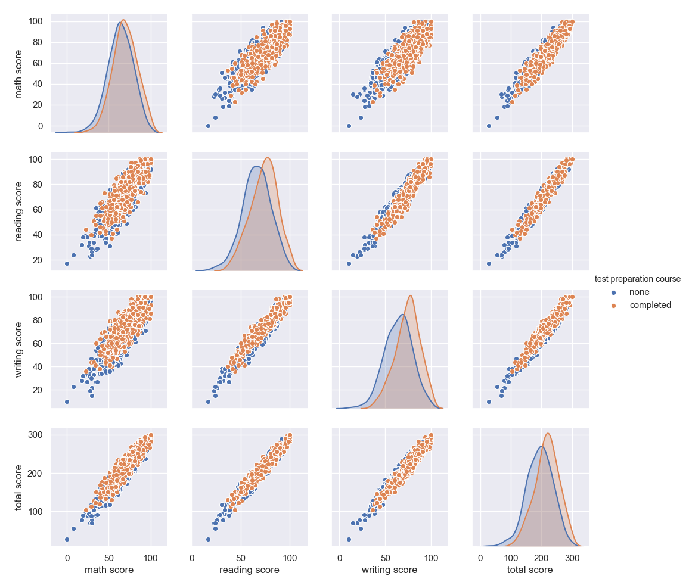

# Students-Performance-on-Exams-Visualized-in-Seaborn-

I was curious at finding some data on students scores and any other data they had along with exam scores. The dataset I used was a free one from Kaggle.
I used Seaborn to make all the visuals in this dataset. The dataset did come quite clean. I checked for some null values, and also added a total score column.
From the data, a few correlations are visible: 

1. Males tended to do a slightly bit better than females on math, but poorer in reading, writing, and overall. 

2. The students who did a test preparation course did better in every category (as is expected).

3. Students with free/reduced lunch did not perform as well as those with regular lunch. 

4. The higher the parental education, the higher the exam score. 

Thank You! 
